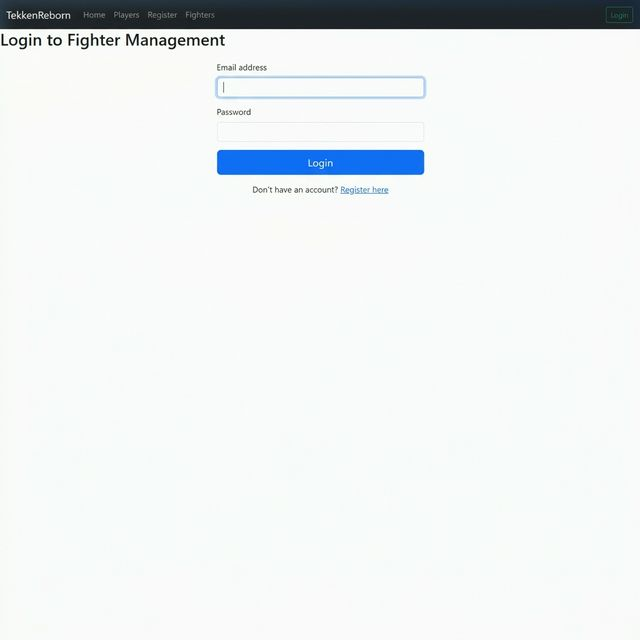
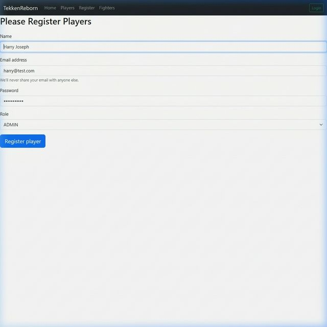
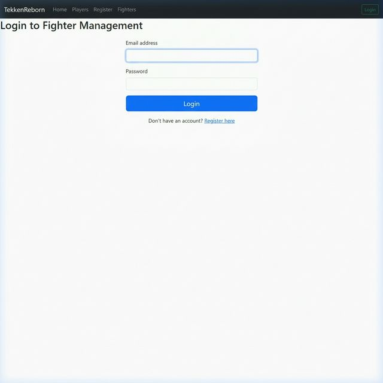
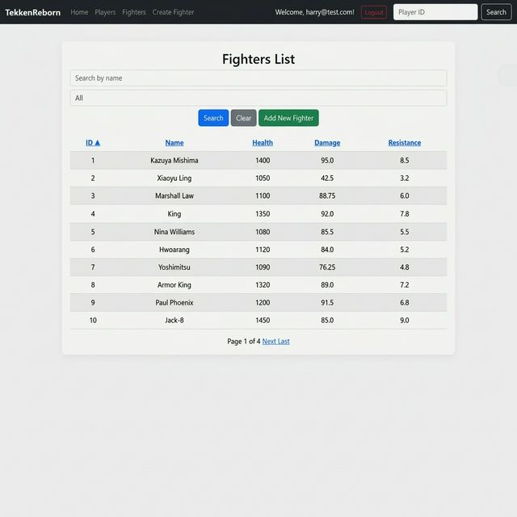
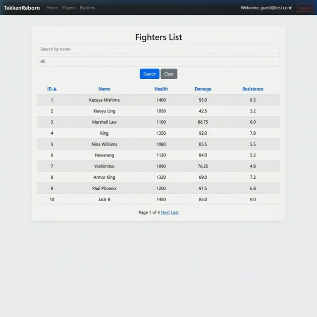
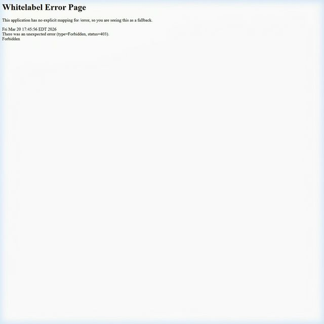
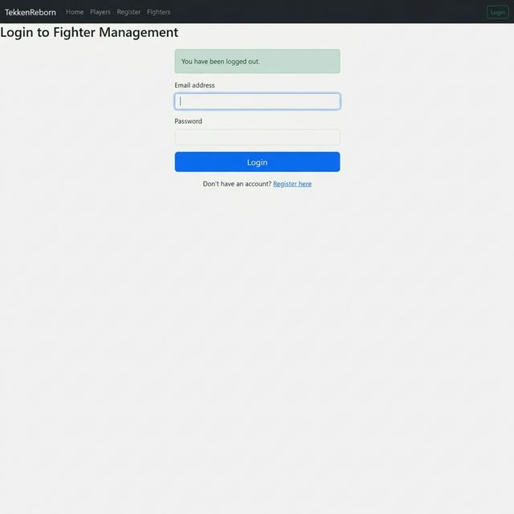

# Lab 5: Spring Security and Role-Based Access Control
**Student Name:** Harry Joseph  
**Student ID:** N00881767  
**Date:** March 20, 2026  

---

## Project Overview
This project focuses on securing the Fighter Management application using Spring Security. It implements user authentication, registration, and role-based access control (RBAC).

## Project Structure
The source code for this lab is located in the root directory.
- `src/`: Java source code and HTML templates.
- `pom.xml`: Maven configuration for dependencies (Spring Security, JPA, H2).
- [REPO_README.md](./REPO_README.md): Original repository documentation for reference.

---

## Laboratory 5: Implementation and Testing
The following sections document the security features implemented and the results of the automated test suite.

### Automated Testing Suite
The following table summarizes the test cases used to verify authentication and authorization rules.

| ID | Test Case | Description | Result |
|---|---|---|---|
| **TC01** | Redirection to Login | Unauthenticated access to `/players` is redirected to `/login`. | ✓ |
| **TC02** | Registration (ADMIN) | A new user can register with the `ADMIN` role. | ✓ |
| **TC03** | Post-Registration Login | Users are redirected to the login page after successful registration. | ✓ |
| **TC04** | RBAC Enforcement (ADMIN) | Admin users can see and access the "Create Fighter" functionality. | ✓ |
| **TC05** | RBAC Enforcement (PLAYER) | Player users cannot see the "Create Fighter" functionality in the UI. | ✓ |
| **TC06** | Access Denial (PLAYER) | Directly accessing protected routes (e.g., `/create-fighter`) as a PLAYER results in a 403 Forbidden error. | ✓ |
| **TC07** | Logout Verification | Users can securely log out, terminating their session. | ✓ |

---

### Test Case Screenshots

#### TC01: Redirection to Login

*When an unauthenticated user attempts to access the players list, the system automatically redirects them to the login page.*

#### TC02: Registration Form (ADMIN)

*A new account is created for 'Harry Joseph' with the `ADMIN` role selected in the registration form.*

#### TC03: Login Page After Registration

*After successful registration, the application redirects the user to the login page to enter their new credentials.*

#### TC04: Admin Dashboard - RBAC Check

*Log in as an ADMIN. The 'Add New Fighter' button is visible in the Navbar and on the page, confirming administrative privileges.*

#### TC05: Player Dashboard - RBAC Check

*Log in as a PLAYER. The 'Add New Fighter' button is hidden from the UI, enforcing role-based visibility.*

#### TC06: Player Access Denied (403 Forbidden)

*Attempting to force access to `/create-fighter` as a PLAYER user results in a system-level 403 Forbidden error.*

#### TC07: Final Logout

*Logging out clears the security context and displays a confirmation message on the login screen.*

---

## Technical Implementation Summary
- **Spring Security Configuration**: Configured a `SecurityFilterChain` bean to define access rules for all application routes.
- **Registration and Password Hashing**: Integrated `BCryptPasswordEncoder` to hash user passwords during the registration process.
- **Custom UserDetailsService**: Implemented a custom service to load user data from the database and map it to Spring Security roles.
- **Thymeleaf Security Integration**: Utilized `sec:authorize` tags to conditionally render UI components based on the authenticated user's role.

